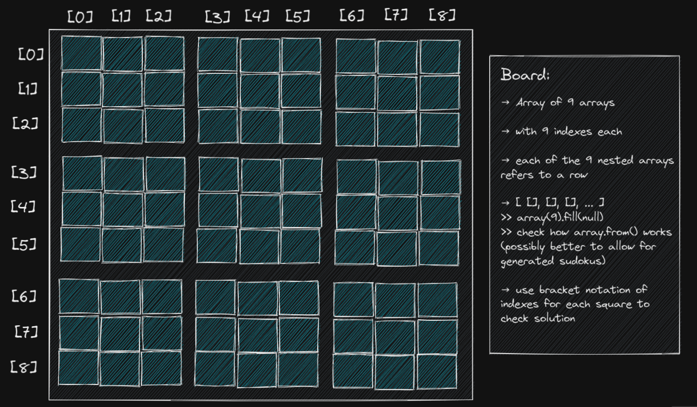
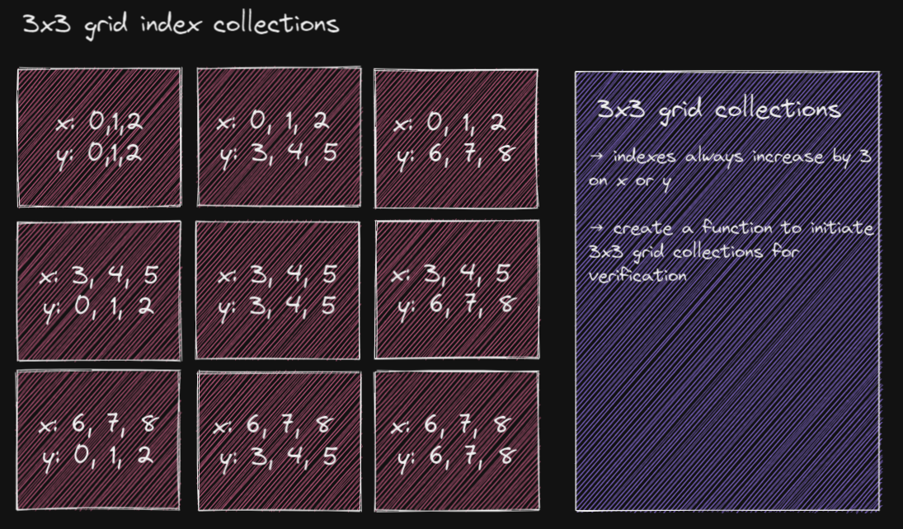

# SUDOKU GAME

### About:
A Fun little Sunday* 🍌 project to create my version of the popular puzzle game: sudoku. The project will be written in React using TypeScript.

\* the sun ☀️ was too tempting, so this is no longer a Sunday project

### Goals:
Recap, solidify and improve my React, TypeScript and computational thinking skills.

## PLAN:

### Game breakdown:
- Set-up:
    - playing board 
        - consists of a 9x9 grid
        
        - additionally "split" into 9 3x3 grid boxes
        
[excalidraw link](https://excalidraw.com/#json=0sxfaCzBmU8z4Q7DHftuZ,w1eRHowgKi6kO5n1DX5dOA)    
    - numbers
        - 1-9 are "valid" numbers
        - some cells on the board are pre-filled with numbers
            - pre-filled cells cannot be changed/edited
        - the remaining cells are empty (hidden)
            - empty/hidden cells are interactive
    - input
        - via keyboard or buttons

- Rules:
    - player should fill the empty/hidden cells with numbers
    - each **row, column** and **3x3 grid box** can only contain the each of the numbers (1-9) once

- Gameplay:
    - player sees playingBoard (9x9 grid) 
        - with pre-filled numbers
        - pre-filled cells are non-interactive
            - if player clicks on non-interactive cell, nothing happens
            - visually differentiate between interactive and non-interactive cells

    - player clicks on an empty/hidden cell (interactive)
        - should be visually highlighted
    - player inputs a number from 1-9
        - game runs verification function
        - highlight any obvious mistakes (conflicts in rows, columns and 3x3 grid) → for both player-input and pre-filled Numbers
        - cells remain interactive for editing
    - player repeats input until all cells are filled
    - once all cells are filled 
        - and there are no conflicts the player wins
        - and there are conflicts player can continue to play

### Notes:
- **Research:** solution validation:
    - hidden numbers: 
        - all cells are filled 
        - some numbers are hidden for the player
        - validate if player input matches the hidden number 
        - potential issues: 
            - if there are multiple possible solution, there will be a "false negative" result
            - comparison between input and hidden number can only happen at the end (as the player should not be able to just try all the numbers, to see which one is correct)
            - the cell would still have to display obvious errors (conflicts in rows, columns or 3x3 grid) → verification function on input
    - empty numbers:
        - only the visible cells have numbers
        - on each input a function to verify conflicts would have to run (same as hidden number version)
        - potential issues:
            - could it be possible to create "unsolvable" sudoku's?
            - if there was a "hint" button, how would the computer know each cells number?
- **Research:** pre-filling cells:
    - hard-code one sudoku puzzle
        - okay as start to get it to work, but won't be scalable 
    - create and import some pre-set sudoku puzzles from a separate file 
        - could randomize displayed puzzle
        - should the file only contain pre-filled cells or solutions as well?
    - create a function to automatically populate the 9x9 grid
        - needs verification to assure solvable puzzles
    - use a sudoku generator npm package

## DEVELOPMENT STEP-BY-STEP:
1. create React app with typescript ✅

1. generate empty playing board 📋
    - empty grid 
        - take in boardState and onClick function (to pass down to square) → *currently using onChange function* ✅
        - create a "square" component and map through a default boardState array ✅
    - squares are interactive (by default) 
        - take in number value & onCLick *(→ onChange)* function as props ✅
        - TODO: update the boardState array ⏰ *(add functionality after implementing sudoku generator npm package)*
    - squares should highlight when clicked/selected ⏰ *(do CSS later, not required for functionality)*
    - FIXME: write tests 🧪 *(rendering, clickable, number value displaying)* ⏰ *(test are not working yet)*
    
1. ⏰ *(use keyboard input initially, implement buttons later on)* generate number input buttons 1-9 🔢
    - input number should display on selected cell
        - needs to set the state of selected square
    - write tests 🧪 *(rendering, clickable, state update)*

1. research sudoku puzzles 🎲 <br>
*I want to avoid writing an algorithm to create valid sudoku puzzles (for now at least)*
    - check for an npm package
        - use for generation of valid sudoku puzzles 
        - check format of generated puzzles 
    - hard-coding one puzzle initially 
        - possibility to create/import more puzzles later (separate file)
        - possibility to create a random puzzle button
1. pre-fill some cells with numbers 🔢
    - pre-filled cells need to be non-interactive
    - visualize cells being non interactive
    - ❗🤔❗ decide how to differentiate between pre-filled and player-filled squares (possibly take in another prop to set interactivity to false if the cell has been pre-filled
        - possibly run a one time function to adjust prop of pre-filled cells only (needs to run once on initiating board)
        - recap on (preventing) re-rendering in react, to avoid resetting this prop
        - else save pre-filled values in separate state to set interactivity → not ideal as it would have to run each time the player inputs a number)
    - write some tests 🧪 *(numbers displaying, cells being non-interactive, cells having different style)*
1. implement validation functionality 🚦


---
## File structure:

```
├── /src
    ├── /__tests__
    │   ├── App.test.tsx
    │   └── Square.test.tsx
    └── /components
        ├── /Board
        │   ├── /Row
        │   │   ├── index.tsx
        │   │   └── Row.module.css        
        │   ├── /Square
        │   │   ├── index.tsx
        │   │   └── Square.module.css
        │   ├── Board.module.css
        │   └── index.tsx
```